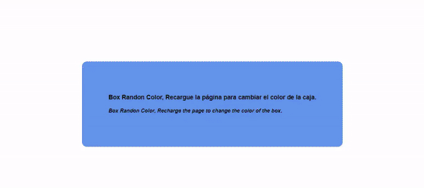

#  Randon Box Color

>Randon Box Color

Pagina web donde se mostrará una caja que al recargar la pagina cambiara su color de fondo.

_The website that when recharged changes the color of the background of the box._

***
## Tools used

* **[REACT:](http://getbootstrap.com/docs/3.3/)** 
   
   REACT es una biblioteca de JavaScript para construir interfaces de usuario.  
  _REACT is a JavaScript library for building user interfaces._  
	

## Related Topics

* [Randon color](https://questionfocus.com/css-pick-a-random-color-from-array.html)

* [Randon color jquery](https://www.vitoshacademy.com/jquery-randomize-anything-random-numbers-with-random-colors/)

## Credits

* **Melissa Nataly Ortiz:** [GitHub Account](https://github.com/Nathoriz).

